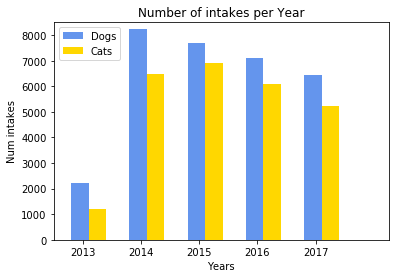
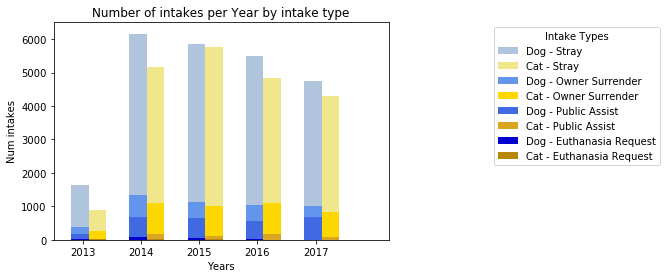
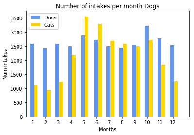
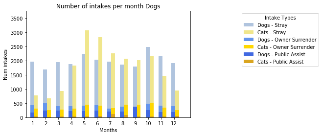
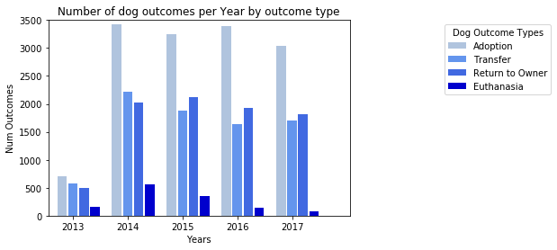
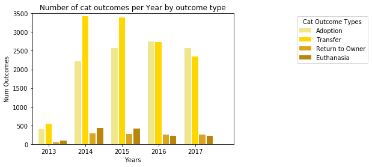
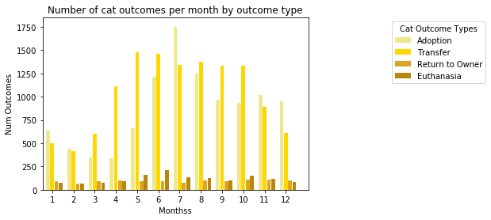

```python
# General Data analysis
```


```python
# Dependencies
import pandas as pd
import numpy as np
import datetime
import matplotlib.pyplot as plt

```


```python
# Set filepaths
csv_filepath1 = "raw data/MergedData.csv"
```


```python
# Read the csv files into new dataframe
df = pd.read_csv(csv_filepath1, encoding="iso-8859-1", low_memory=False)
df.head()
```


<div>
<style>
    .dataframe thead tr:only-child th {
        text-align: right;
    }

    .dataframe thead th {
        text-align: left;
    }

    .dataframe tbody tr th {
        vertical-align: top;
    }
</style>
<table border="1" class="dataframe">
  <thead>
    <tr style="text-align: right;">
      <th></th>
      <th>Animal ID</th>
      <th>Name_intake</th>
      <th>DateTime_intake</th>
      <th>Found Location</th>
      <th>Intake Type</th>
      <th>Intake Condition</th>
      <th>Animal Type_intake</th>
      <th>Sex upon Intake</th>
      <th>Age upon Intake</th>
      <th>Breed_intake</th>
      <th>...</th>
      <th>Year_outcome</th>
      <th>Sex_outcome</th>
      <th>Female_outcome</th>
      <th>Male_outcome</th>
      <th>SpayNeuter_outcome</th>
      <th>Purebred_outcome</th>
      <th>NumAge_outcome</th>
      <th>AgeUnits_outcome</th>
      <th>AgeDays_outcome</th>
      <th>Intake Outcome Days</th>
    </tr>
  </thead>
  <tbody>
    <tr>
      <th>0</th>
      <td>A748291</td>
      <td>*Madison</td>
      <td>2017-05-01 14:26:00</td>
      <td>S Pleasant Valley Rd And E Riverside Dr in Aus...</td>
      <td>Stray</td>
      <td>Normal</td>
      <td>Dog</td>
      <td>Intact Female</td>
      <td>10 months</td>
      <td>Pit Bull Mix</td>
      <td>...</td>
      <td>2017</td>
      <td>Female</td>
      <td>1.0</td>
      <td>0.0</td>
      <td>Yes</td>
      <td>0</td>
      <td>1.0</td>
      <td>year</td>
      <td>365.0</td>
      <td>125 days 09:34:00.000000000</td>
    </tr>
    <tr>
      <th>1</th>
      <td>A750529</td>
      <td>NaN</td>
      <td>2017-05-28 13:22:00</td>
      <td>8312 North Ih 35 in Austin (TX)</td>
      <td>Stray</td>
      <td>Normal</td>
      <td>Dog</td>
      <td>Intact Female</td>
      <td>5 months</td>
      <td>Miniature Schnauzer Mix</td>
      <td>...</td>
      <td>2017</td>
      <td>Female</td>
      <td>1.0</td>
      <td>0.0</td>
      <td>Yes</td>
      <td>0</td>
      <td>5.0</td>
      <td>month</td>
      <td>150.0</td>
      <td>4 days 03:20:00.000000000</td>
    </tr>
    <tr>
      <th>2</th>
      <td>A730601</td>
      <td>NaN</td>
      <td>2016-07-07 12:11:00</td>
      <td>1109 Shady Ln in Austin (TX)</td>
      <td>Stray</td>
      <td>Normal</td>
      <td>Cat</td>
      <td>Intact Male</td>
      <td>7 months</td>
      <td>Domestic Shorthair Mix</td>
      <td>...</td>
      <td>2016</td>
      <td>Male</td>
      <td>0.0</td>
      <td>1.0</td>
      <td>Yes</td>
      <td>0</td>
      <td>7.0</td>
      <td>month</td>
      <td>210.0</td>
      <td>0 days 20:49:00.000000000</td>
    </tr>
    <tr>
      <th>3</th>
      <td>A748238</td>
      <td>NaN</td>
      <td>2017-05-01 10:53:00</td>
      <td>Airport Blvd And Oak Springs Dr in Austin (TX)</td>
      <td>Stray</td>
      <td>Normal</td>
      <td>Dog</td>
      <td>Intact Male</td>
      <td>3 years</td>
      <td>Bichon Frise Mix</td>
      <td>...</td>
      <td>2017</td>
      <td>Male</td>
      <td>0.0</td>
      <td>1.0</td>
      <td>Yes</td>
      <td>0</td>
      <td>3.0</td>
      <td>year</td>
      <td>1095.0</td>
      <td>5 days 05:04:00.000000000</td>
    </tr>
    <tr>
      <th>4</th>
      <td>A683644</td>
      <td>*Zoey</td>
      <td>2014-07-13 11:02:00</td>
      <td>Austin (TX)</td>
      <td>Owner Surrender</td>
      <td>Nursing</td>
      <td>Dog</td>
      <td>Intact Female</td>
      <td>4 weeks</td>
      <td>Border Collie Mix</td>
      <td>...</td>
      <td>2014</td>
      <td>Female</td>
      <td>1.0</td>
      <td>0.0</td>
      <td>Yes</td>
      <td>0</td>
      <td>4.0</td>
      <td>month</td>
      <td>120.0</td>
      <td>115 days 23:04:00.000000000</td>
    </tr>
  </tbody>
</table>
<p>5 rows × 42 columns</p>
</div>


```python
print(df.columns)
```

    Index(['Animal ID', 'Name_intake', 'DateTime_intake', 'Found Location',
           'Intake Type', 'Intake Condition', 'Animal Type_intake',
           'Sex upon Intake', 'Age upon Intake', 'Breed_intake', 'Color_intake',
           'Month_intake', 'Year_intake', 'Sex_intake', 'Female_intake',
           'Male_intake', 'SpayNeuter_intake', 'Purebred_intake', 'NumAge_intake',
           'AgeUnits_intake', 'AgeDays_intake', 'Name_outcome', 'DateTime_outcome',
           'Date of Birth', 'Outcome Type', 'Outcome Subtype',
           'Animal Type_outcome', 'Sex upon Outcome', 'Age upon Outcome',
           'Breed_outcome', 'Color_outcome', 'Month_outcome', 'Year_outcome',
           'Sex_outcome', 'Female_outcome', 'Male_outcome', 'SpayNeuter_outcome',
           'Purebred_outcome', 'NumAge_outcome', 'AgeUnits_outcome',
           'AgeDays_outcome', 'Intake Outcome Days'],
          dtype='object')
    


```python
#Filter for only Dogs and Cats
#animalData_df = animalData_df.loc[animalData_df["Animal Type_intake"].isin(["Dog","Cat"])]
```


```python
# Get metrics on the raw outcomes file
df.describe()
```


<div>
<style>
    .dataframe thead tr:only-child th {
        text-align: right;
    }

    .dataframe thead th {
        text-align: left;
    }

    .dataframe tbody tr th {
        vertical-align: top;
    }
</style>
<table border="1" class="dataframe">
  <thead>
    <tr style="text-align: right;">
      <th></th>
      <th>Month_intake</th>
      <th>Year_intake</th>
      <th>Female_intake</th>
      <th>Male_intake</th>
      <th>Purebred_intake</th>
      <th>NumAge_intake</th>
      <th>AgeDays_intake</th>
      <th>Month_outcome</th>
      <th>Year_outcome</th>
      <th>Female_outcome</th>
      <th>Male_outcome</th>
      <th>Purebred_outcome</th>
      <th>NumAge_outcome</th>
      <th>AgeDays_outcome</th>
    </tr>
  </thead>
  <tbody>
    <tr>
      <th>count</th>
      <td>57593.000000</td>
      <td>57593.000000</td>
      <td>57592.000000</td>
      <td>57592.000000</td>
      <td>57593.000000</td>
      <td>57593.000000</td>
      <td>57593.000000</td>
      <td>57593.000000</td>
      <td>57593.000000</td>
      <td>57591.000000</td>
      <td>57591.000000</td>
      <td>57593.000000</td>
      <td>57588.000000</td>
      <td>57593.000000</td>
    </tr>
    <tr>
      <th>mean</th>
      <td>6.708697</td>
      <td>2015.260709</td>
      <td>0.462425</td>
      <td>0.490294</td>
      <td>0.048947</td>
      <td>3.457382</td>
      <td>742.241818</td>
      <td>6.850589</td>
      <td>2015.294480</td>
      <td>0.462416</td>
      <td>0.490302</td>
      <td>0.048947</td>
      <td>3.557599</td>
      <td>756.069627</td>
    </tr>
    <tr>
      <th>std</th>
      <td>3.210898</td>
      <td>1.210101</td>
      <td>0.498590</td>
      <td>0.499910</td>
      <td>0.215759</td>
      <td>2.936187</td>
      <td>1087.364762</td>
      <td>3.262525</td>
      <td>1.207164</td>
      <td>0.498590</td>
      <td>0.499910</td>
      <td>0.215759</td>
      <td>2.929233</td>
      <td>1089.431333</td>
    </tr>
    <tr>
      <th>min</th>
      <td>1.000000</td>
      <td>2013.000000</td>
      <td>0.000000</td>
      <td>0.000000</td>
      <td>0.000000</td>
      <td>0.000000</td>
      <td>0.000000</td>
      <td>1.000000</td>
      <td>2013.000000</td>
      <td>0.000000</td>
      <td>0.000000</td>
      <td>0.000000</td>
      <td>0.000000</td>
      <td>0.000000</td>
    </tr>
    <tr>
      <th>25%</th>
      <td>4.000000</td>
      <td>2014.000000</td>
      <td>0.000000</td>
      <td>0.000000</td>
      <td>0.000000</td>
      <td>1.000000</td>
      <td>30.000000</td>
      <td>4.000000</td>
      <td>2014.000000</td>
      <td>0.000000</td>
      <td>0.000000</td>
      <td>0.000000</td>
      <td>2.000000</td>
      <td>60.000000</td>
    </tr>
    <tr>
      <th>50%</th>
      <td>7.000000</td>
      <td>2015.000000</td>
      <td>0.000000</td>
      <td>0.000000</td>
      <td>0.000000</td>
      <td>2.000000</td>
      <td>365.000000</td>
      <td>7.000000</td>
      <td>2015.000000</td>
      <td>0.000000</td>
      <td>0.000000</td>
      <td>0.000000</td>
      <td>2.000000</td>
      <td>365.000000</td>
    </tr>
    <tr>
      <th>75%</th>
      <td>9.000000</td>
      <td>2016.000000</td>
      <td>1.000000</td>
      <td>1.000000</td>
      <td>0.000000</td>
      <td>4.000000</td>
      <td>730.000000</td>
      <td>10.000000</td>
      <td>2016.000000</td>
      <td>1.000000</td>
      <td>1.000000</td>
      <td>0.000000</td>
      <td>5.000000</td>
      <td>730.000000</td>
    </tr>
    <tr>
      <th>max</th>
      <td>12.000000</td>
      <td>2017.000000</td>
      <td>1.000000</td>
      <td>1.000000</td>
      <td>1.000000</td>
      <td>22.000000</td>
      <td>8030.000000</td>
      <td>12.000000</td>
      <td>2017.000000</td>
      <td>1.000000</td>
      <td>1.000000</td>
      <td>1.000000</td>
      <td>22.000000</td>
      <td>8030.000000</td>
    </tr>
  </tbody>
</table>
</div>


```python
#Metrics cont'd
data_recs = len(df)
data_AnimalTypes = df.groupby(["Animal Type_intake"]).size()
data_Sex = df.groupby(["Animal Type_intake", "Sex_intake"]).size()
data_Intake = df.groupby(["Animal Type_intake", "Intake Type"]).size()
data_Yearly_Intake = df.groupby(["Animal Type_intake", "Intake Type", "Year_intake"]).size()
data_Monthly_Intake = df.groupby(["Animal Type_intake", "Intake Type", "Month_intake"]).size()
data_Outcome = df.groupby(["Animal Type_intake", "Outcome Type"]).size()

print(f"Number of records in Outcomes file: {data_recs}")
print(f"Number of Animal Type: {data_AnimalTypes}")
print(f"Number of Animals by Type and Sex: {data_Sex}")
print(f"Number of Animals by Type and Intake Reason: {data_Intake}")
print(f"Number of Animals by Type and Outcome: {data_Outcome}")
```

    Number of records in Outcomes file: 57593
    Number of Animal Type: Animal Type_intake
    Cat    25896
    Dog    31697
    dtype: int64
    Number of Animals by Type and Sex: Animal Type_intake  Sex_intake 
    Cat                 Female         11909
                        Male           11474
                        Unknown Sex     2513
    Dog                 Female         14723
                        Male           16763
                        Unknown Sex      210
    dtype: int64
    Number of Animals by Type and Intake Reason: Animal Type_intake  Intake Type       
    Cat                 Euthanasia Request       50
                        Owner Surrender        4313
                        Public Assist           558
                        Stray                 20975
    Dog                 Euthanasia Request      169
                        Owner Surrender        4913
                        Public Assist          2736
                        Stray                 23879
    dtype: int64
    Number of Animals by Type and Outcome: Animal Type_intake  Outcome Type   
    Cat                 Adoption           10508
                        Died                 376
                        Disposal              12
                        Euthanasia          1390
                        Missing               26
                        Return to Owner     1121
                        Rto-Adopt             17
                        Transfer           12446
    Dog                 Adoption           13830
                        Died                 128
                        Disposal              10
                        Euthanasia          1262
                        Missing               11
                        Return to Owner     8375
                        Rto-Adopt             63
                        Transfer            8016
    dtype: int64
    


```python
dogs_df = df[df["Animal Type_intake"]=="Dog"]
cats_df = df[df["Animal Type_intake"]=="Cat"]
```


```python
#Chart total intakes per year

dogsYrGrp = dogs_df.groupby(["Year_intake"], as_index=False)
dogsYrCnt = dogsYrGrp["Animal ID"].count()
dogsYears = dogsYrCnt["Year_intake"]
dogCnt = dogsYrCnt["Animal ID"]

catYrGrp = cats_df.groupby(["Year_intake"], as_index=False)
catYrCnt = catYrGrp["Animal ID"].count()
catCnt = catYrCnt["Animal ID"]

x_axis = np.arange(0, len(dogsYears), 1)

plt.bar(x_axis-0.3, dogCnt,width=w,color='cornflowerblue',align='center', label="Dogs")
plt.bar(x_axis, catCnt,width=w,color='gold',align='center', label="Cats")
plt.autoscale(tight=True)

# Create the ticks for our bar chart's x axis
tick_locations = [value-0.25 for value in x_axis]
plt.xticks(tick_locations, dogsYears)

# Set the limits of the x axis
plt.xlim(-.75, len(x_axis))

# Set the limits of the y axis
plt.ylim(0, 8500)

# Give the chart a title, x label, and y label
plt.title(f"Number of intakes per Year")
plt.xlabel("Years")
plt.ylabel("Num intakes")

plt.legend(bbox_to_anchor=(0, 1), loc='upper left', ncol=1)

plt.show()
```





```python
#Chart total intakes by type per year

Years = df["Year_intake"].unique()
intakeTypes = df["Intake Type"].unique()
dogColors = ["lightsteelblue","cornflowerblue","royalblue","mediumblue","darkblue","slateblue","blueviolet"]
catColors = ["khaki","gold","goldenrod","darkgoldenrod","darkkhaki","olive","darkolive"]
colorCnt = 0

for iType in intakeTypes:
    idogs_df = dogs_df[dogs_df["Intake Type"]==iType]
    dogsYrGrp = idogs_df.groupby(["Year_intake"], as_index=False)
    dogsYrCnt = dogsYrGrp["Animal ID"].count()
    dogCnt = dogsYrCnt["Animal ID"]
    
    icats_df = cats_df[cats_df["Intake Type"]==iType]
    catsYrGrp = icats_df.groupby(["Year_intake"], as_index=False)
    catsYrCnt = catsYrGrp["Animal ID"].count()
    catCnt = catsYrCnt["Animal ID"]
    
    x_axis = np.arange(0, len(Years), 1)
   
    plt.bar(x_axis-0.3, dogCnt,width=w,color=dogColors[colorCnt],align='center', label="Dog - "+iType)
    plt.bar(x_axis, catCnt,width=w,color=catColors[colorCnt],align='center', label="Cat - "+iType)
    colorCnt += 1

plt.legend(bbox_to_anchor=(1.3, 1), loc='upper left', ncol=1, title="Intake Types") 

plt.autoscale(tight=True)

# Create the ticks for our bar chart's x axis
tick_locations = [value-0.25 for value in x_axis]
plt.xticks(tick_locations, dogsYears)

# Set the limits of the x axis
plt.xlim(-.75, len(x_axis))

# Set the limits of the y axis
plt.ylim(0, 6500)

# Give the chart a title, x label, and y label
plt.title(f"Number of intakes per Year by intake type")
plt.xlabel("Years")
plt.ylabel("Num intakes")


plt.show()
```





```python
#Chart total intakes per Month of year

dogsMoGrp = dogs_df.groupby(["Month_intake"], as_index=False)
dogsMoCnt = dogsMoGrp["Animal ID"].count()
dogsMonths = dogsMoCnt["Month_intake"]
dogCnt = dogsMoCnt["Animal ID"]

catMoGrp = cats_df.groupby(["Month_intake"], as_index=False)
catMoCnt = catMoGrp["Animal ID"].count()
catCnt = catMoCnt["Animal ID"]

x_axis = np.arange(0, len(dogsMonths), 1)

plt.bar(x_axis-0.3, dogCnt,width=w,color='cornflowerblue',align='center', label="Dogs")
plt.bar(x_axis, catCnt,width=w,color='gold',align='center', label="Cats")
plt.autoscale(tight=True)

# Create the ticks for our bar chart's x axis
tick_locations = [value-0.25 for value in x_axis]
plt.xticks(tick_locations, dogsMonths)

# Set the limits of the x axis
plt.xlim(-.75, len(x_axis))

# Set the limits of the y axis
plt.ylim(0, 3750)

# Give the chart a title, x label, and y label
plt.title(f"Number of intakes per month Dogs")
plt.xlabel("Months")
plt.ylabel("Num intakes")

plt.legend(bbox_to_anchor=(0, 1), loc='upper left', ncol=1)

plt.show()
```





```python
#Chart total intakes by type per month

MintakeTypes =["Stray","Owner Surrender", "Public Assist", ]
colorCnt = 0

for iType in MintakeTypes:
    idogs_df = dogs_df[dogs_df["Intake Type"]==iType]
    dogsMoGrp = idogs_df.groupby(["Month_intake"], as_index=False)
    dogsMoCnt = dogsMoGrp["Animal ID"].count()
    dogsMonths = dogsMoCnt["Month_intake"]
    dogCnt = dogsMoCnt["Animal ID"]
    
    icats_df = cats_df[cats_df["Intake Type"]==iType]
    catMoGrp = icats_df.groupby(["Month_intake"], as_index=False)
    catMoCnt = catMoGrp["Animal ID"].count()
    catCnt = catMoCnt["Animal ID"]
    
    x_axis = np.arange(0, len(dogsMonths), 1)

    plt.bar(x_axis-0.3, dogCnt,width=w,color=dogColors[colorCnt],align='center', label="Dogs - "+iType)
    plt.bar(x_axis, catCnt,width=w,color=catColors[colorCnt],align='center', label="Cats - "+iType)
   
    colorCnt += 1

plt.autoscale(tight=True)

# Create the ticks for our bar chart's x axis
tick_locations = [value-0.25 for value in x_axis]
plt.xticks(tick_locations, dogsMonths)

# Set the limits of the x axis
plt.xlim(-.75, len(x_axis))

# Set the limits of the y axis
plt.ylim(0, 3750)

# Give the chart a title, x label, and y label
plt.title(f"Number of intakes per month Dogs")
plt.xlabel("Months")
plt.ylabel("Num intakes")

plt.legend(bbox_to_anchor=(1.3, 1), loc='upper left', ncol=1, title="Intake Types")

plt.show()
```





```python
#Chart total outcomes by type per year

Years = df["Year_outcome"].unique()
outcomeTypes = ["Adoption","Transfer","Return to Owner","Euthanasia"]

colorCnt = 0
w=0

for iType in outcomeTypes:
    idogs_df = dogs_df[dogs_df["Outcome Type"]==iType]
    dogsYrGrp = idogs_df.groupby(["Year_outcome"], as_index=False)
    dogsYrCnt = dogsYrGrp["Animal ID"].count()
    dogsYears = dogsYrCnt["Year_outcome"]
    dogCnt = dogsYrCnt["Animal ID"]
    
    x_axis = np.arange(0, len(dogsYears), 1)
   
    plt.bar(x_axis+w, dogCnt,width=0.175,color=dogColors[colorCnt],align='center', label=iType)
    #plt.bar(x_axis, catCnt,width=w,color=catColors[colorCnt],align='center', label="Cat - "+iType)
    colorCnt += 1
    w+=0.2

plt.legend(bbox_to_anchor=(1.3, 1), loc='upper left', ncol=1, title="Dog Outcome Types") 

plt.autoscale(tight=True)

# Create the ticks for our bar chart's x axis
tick_locations = [value+0.2 for value in x_axis]
plt.xticks(tick_locations, dogsYears)

# Set the limits of the x axis
plt.xlim(-.25, len(x_axis)+.25)

# Set the limits of the y axis
plt.ylim(0, 3500)

# Give the chart a title, x label, and y label
plt.title(f"Number of dog outcomes per Year by outcome type")
plt.xlabel("Years")
plt.ylabel("Num Outcomes")

plt.show()


# --- Cats  ---
colorCnt = 0
w=0

for iType in outcomeTypes:
    icats_df = cats_df[cats_df["Outcome Type"]==iType]
    catsYrGrp = icats_df.groupby(["Year_outcome"], as_index=False)
    catsYrCnt = catsYrGrp["Animal ID"].count()
    catsYears = catsYrCnt["Year_outcome"]
    catCnt = catsYrCnt["Animal ID"]
        
    x_axis = np.arange(0, len(catsYears), 1)
   
    plt.bar(x_axis+w, catCnt,width=0.175,color=catColors[colorCnt],align='center', label=iType)
    colorCnt += 1
    w+=0.2

plt.legend(bbox_to_anchor=(1.3, 1), loc='upper left', ncol=1, title="Cat Outcome Types") 

plt.autoscale(tight=True)

# Create the ticks for our bar chart's x axis
tick_locations = [value+0.2 for value in x_axis]
plt.xticks(tick_locations, dogsYears)

# Set the limits of the x axis
plt.xlim(-.25, len(x_axis)+.25)

# Set the limits of the y axis
plt.ylim(0, 3500)

# Give the chart a title, x label, and y label
plt.title(f"Number of cat outcomes per Year by outcome type")
plt.xlabel("Years")
plt.ylabel("Num Outcomes")


plt.show()
```








```python
#Chart total outcomes by type per month

Months = df["Month_outcome"].unique()
outcomeTypes = ["Adoption","Transfer","Return to Owner","Euthanasia"]

colorCnt = 0
w=0

for iType in outcomeTypes:
    idogs_df = dogs_df[dogs_df["Outcome Type"]==iType]
    dogsMoGrp = idogs_df.groupby(["Month_outcome"], as_index=False)
    dogsMoCnt = dogsMoGrp["Animal ID"].count()
    dogsMonths = dogsMoCnt["Month_outcome"]
    dogCnt = dogsMoCnt["Animal ID"]
    
    x_axis = np.arange(0, len(dogsMonths), 1)
   
    plt.bar(x_axis+w, dogCnt,width=0.175,color=dogColors[colorCnt],align='center', label=iType)
    colorCnt += 1
    w+=0.2

plt.legend(bbox_to_anchor=(1.3, 1), loc='upper left', ncol=1, title="Dog Outcome Types") 

plt.autoscale(tight=True)

# Create the ticks for our bar chart's x axis
tick_locations = [value+0.2 for value in x_axis]
plt.xticks(tick_locations, dogsMonths)

# Set the limits of the x axis
plt.xlim(-.25, len(x_axis)+.25)

# Set the limits of the y axis
plt.ylim(0, 1850)

# Give the chart a title, x label, and y label
plt.title(f"Number of dog outcomes per month by outcome type")
plt.xlabel("Months")
plt.ylabel("Num Outcomes")

plt.show()


# --- Cats  ---
colorCnt = 0
w=0

for iType in outcomeTypes:
    icats_df = cats_df[cats_df["Outcome Type"]==iType]
    catsMoGrp = icats_df.groupby(["Month_outcome"], as_index=False)
    catsMoCnt = catsMoGrp["Animal ID"].count()
    catsMonths = catsMoCnt["Month_outcome"]
    catCnt = catsMoCnt["Animal ID"]
        
    x_axis = np.arange(0, len(catsMonths), 1)
   
    plt.bar(x_axis+w, catCnt,width=0.175,color=catColors[colorCnt],align='center', label=iType)
    colorCnt += 1
    w+=0.2

plt.legend(bbox_to_anchor=(1.3, 1), loc='upper left', ncol=1, title="Cat Outcome Types") 

plt.autoscale(tight=True)

# Create the ticks for our bar chart's x axis
tick_locations = [value+0.2 for value in x_axis]
plt.xticks(tick_locations, catsMonths)

# Set the limits of the x axis
plt.xlim(-.25, len(x_axis)+.25)

# Set the limits of the y axis
plt.ylim(0, 1850)

# Give the chart a title, x label, and y label
plt.title(f"Number of cat outcomes per month by outcome type")
plt.xlabel("Monthss")
plt.ylabel("Num Outcomes")


plt.show()
```





```python

```
